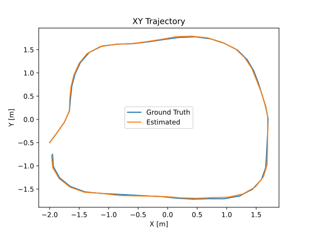

# LiDAR SLAM (Grid-Based Method)

This repository contains the implementation and evaluation of a **grid-based LiDAR SLAM** approach with dynamic object filtering in a TurtleBot3 simulation environment. The experiments focus on mapping and localization performance under dynamic conditions.

---

## 📦 Prerequisites

- Ubuntu 22.04  
- ROS 2 Humble installed and sourced  
- `turtlebot3_description`, `turtlebot3_gazebo`, and other core TurtleBot3 packages  

---

## 🔧 Installing Dependencies

1. **Update apt cache**  
   ```bash
   sudo apt update
   ```

2. **Install extra system deps**  
   Make sure you have `apt_requirements.txt` in the workspace root containing:
   ```
   xterm
   ```
   Then run:
   ```bash
   xargs sudo apt install -y < apt_requirements.txt
   ```

3. **Install all ROS 2/Gazebo/TurtleBot3 deps**  
   ```bash
   sudo rosdep init || true
   rosdep update
   rosdep install --from-paths src --ignore-src -r -y
   ```
---

## Materials

### Experimental Environment and Robot Platform

#### Simulation Environment: `turtlebot3_world`
All experiments were conducted in the pre-built **TurtleBot3 simulation environment** (`turtlebot3_world`) provided by the TurtleBot3 ROS packages. A moving cubed object was added with customizable pose, velocity, and limits.


#### TurtleBot3 Models Comparison
TurtleBot3 comes in three variants: **Burger**, **Waffle**, and **Waffle Pi**. Key specifications relevant to SLAM are summarized below:

| Specification       | Burger               | Waffle              | Waffle Pi           |
|--------------------|--------------------|-------------------|------------------|
| Processor           | OpenCR + SBC       | OpenCR + SBC      | OpenCR + Raspberry Pi 3 |
| LiDAR Sensor        | LDS-02 (360°)      | LDS-02 (360°)     | LDS-02 (360°)    |
| Camera              | None               | Intel RealSense    | Raspberry Pi Camera |
| IMU                 | Yes                | Yes               | Yes              |
| Wheel Encoder       | Yes                | Yes               | Yes              |
| Size (W×L×H, mm)   | 138×178×192        | 281×306×141       | 281×306×141      |
| Weight              | ~1.0 kg            | ~1.8 kg           | ~1.8 kg          |
| Battery Life        | ~2.5 hours         | ~1.5 hours        | ~1.5 hours       |

> **Note:** Our experiments focus solely on **LiDAR-based SLAM** and grid-based dynamic object filtering. We used the **Burger model**, which has no camera, to reduce computational overhead.


---

## Methods

### SLAM Toolbox Custom Integration

We customized the **SLAM Toolbox** launch files and YAML configurations for **ROS 2 Humble + Gazebo Classic**.

#### Launch File Customizations
- **Centralized Config Loading:** Both `launch/online_async_launch.py` and `launch/online_sync_launch.py` accept a `slam_params_file` argument pointing to our custom YAML configuration.
- **Async vs Sync Choice:** Separate launch files allow switching between asynchronous and synchronous mapping modes easily.

#### YAML Configuration Modifications
- **Custom Scan Topic:** Changed `scan_topic` from `/scan` to `/preprocessed_scan` to include preprocessing.
- **LiDAR Range Settings:** Set `min_laser_range` and `max_laser_range` to sensor specifications.
- **Map Update Interval:** Tuned for CPU efficiency (1.0 s async, 0.5 s sync).
- **Zero Travel Thresholds:** Set `minimum_travel_distance` and `minimum_travel_heading` to `0.0`.

### Median Filter
A sliding-window **median filter** is applied to remove spurious dynamic points:

$$
y_i = \mathrm{median}\Big(x_{i - \lfloor w/2 \rfloor}, \dots, x_i, \dots, x_{i + \lfloor w/2 \rfloor}\Big)
$$

**Observations:**
- Reduces transient dynamic artifacts.
- Cannot remove slow-moving or large objects perfectly.
- Improves map quality even with small window sizes.

| Metric              | Before Filtering | After Filtering |
|--------------------|----------------|----------------|
| Dynamic SSIM        | 0.8668         | 0.9032         |
| Normalized NE (px)  | 0.35           | 0.11           |


### Consecutive-Scan Background Subtraction
- Projects scans to world coordinates and compares consecutive scans.
- **Limitation:** Fails due to one-frame memory, no proper registration, and high computational cost.

### Map Comparison Filtering
- Detects dynamic cells by differencing consecutive occupancy grids.
- **Limitation:** SLAM Toolbox does not update free cells immediately, leading to missed detections.

### Occupancy Threshold Manipulation
- Adjusted occupancy threshold ($\tau$) to suppress dynamic artifacts.  
- **Optimal value:** ($\tau = 0.4$) balances dynamic suppression with static structure retention.


### Engineering Experiment
We evaluated **median filtering** and **occupancy thresholding** across dynamic scenarios:

| Group      | Experiments | Description                              |
|------------|------------|------------------------------------------|
| Baseline   | 4          | No filtering                              |
| Median     | 4          | Sliding-window median filtering           |
| Occupancy  | 4          | Thresholding occupancy probabilities      |
| Static     | -          | Ground-truth reference map                |

| Experiment # | x [m] | y [m] | z [m] | v [m/s] |
|--------------|-------|-------|-------|---------|
| 1            | 0.4   | 0.6   | 0.2   | 0.05    |
| 2            | 0.4   | 0.6   | 0.2   | 0.5     |
| 3            | 0.4   | 0.2   | 0.2   | 0.5     |
| 4            | 0.4   | 0.2   | 0.2   | 0.05    |

**Data Collected:**
- Ground-truth robot pose from Gazebo.
- Estimated robot pose from SLAM system.
- Generated maps and trajectories for evaluation.



**Map Evaluation Metrics:**
- Pixel-wise differences
- Free/occupied classification: Precision, Recall, F1-score

---

## Results and Discussion

### Map Evaluation

**Pixel-Level Differences:**
- Median filter experiments: ~1.5%–2.1% difference.
- Occupancy threshold filter: up to 2.6%, removing most dynamic objects but causing some static deletion.

**F1 Scores:**
- Median filter: up to 0.9933, best balance.
- Occupancy filter: slightly lower F1, high recall but lower precision.


**Discussion:**  
- Occupancy threshold removes dynamic objects effectively but misclassifies some static areas.  
- Median filtering preserves structure but may retain minor motion artifacts.  
- Choice depends on application-specific trade-offs.

### Localization Accuracy Analysis

- Median filter experiments (m5–m8) reduce translational and orientation errors compared to static baseline.
- Occupancy filter shows mixed localization improvement across experiments.


**Discussion:**  
- Both filtering methods can improve localization depending on scenario.
- Trade-offs between dynamic object suppression and static map accuracy must be considered.

---

## References
- ROS 2 SLAM Toolbox: [https://github.com/SteveMacenski/slam_toolbox](https://github.com/SteveMacenski/slam_toolbox)
- TurtleBot3: [https://emanual.robotis.com/docs/en/platform/turtlebot3/overview/](https://emanual.robotis.com/docs/en/platform/turtlebot3/overview/)
